# test.github.io

## Hello, User!
  
  You see the app - [“Planner”](https://ihor1998.github.io/test.github.io/). There you can plan your events, throughout the one working week. Everyday from 10am to 18pm you can book only one hour for an event provided this cell has not already booked. 

### Let’s go to functional: 

#### Window “Planner”: 

Here created events are added to the cell, according to the selected day and time.

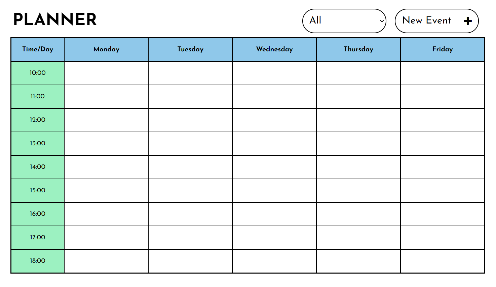

The cells where the events were added are highlighted in yellow. You can also delete an event by pressing the button "X".

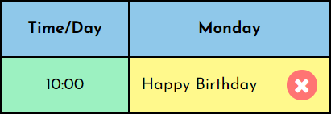

Then a modal window will appear.

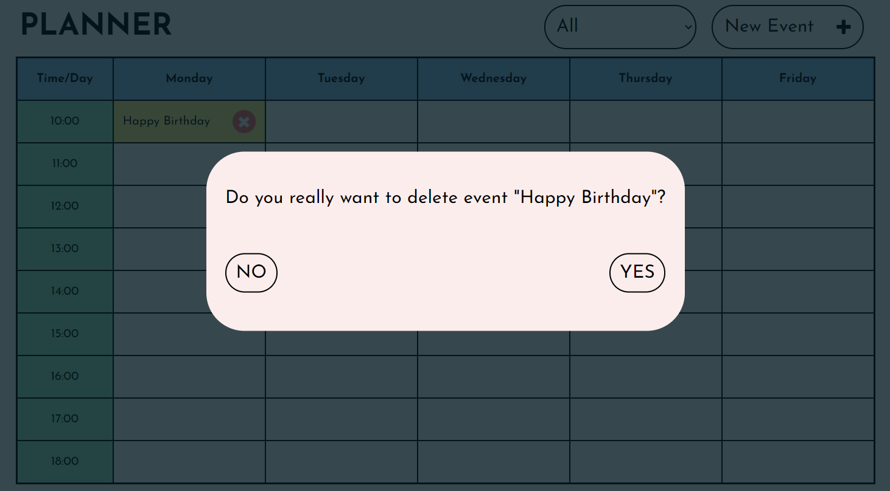

By clicking on the button “NO”, the modal window will close and you will be returned to the “Planner” window, if “YES”, the event will be deleted.

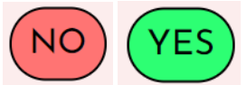

With this select, you can filter events by attendees.

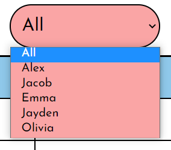

By clicking on the "New Event" button, you will go to the "Create Event" window

#### Window “create event”:

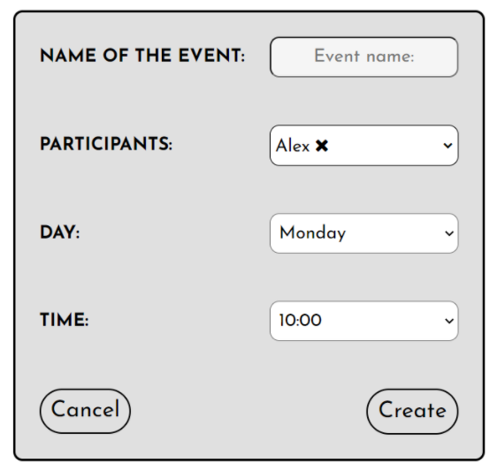

#### Here you need to indicate necessary information about your event, namely:

1) Name of the event:

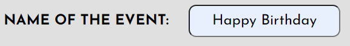

 2) Participants list:

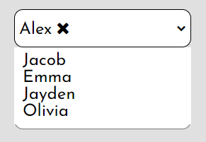

 3) Day:

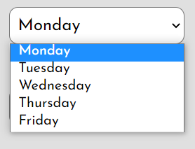

4) Time:

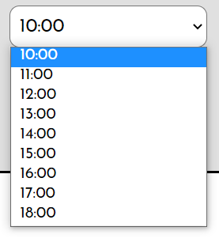

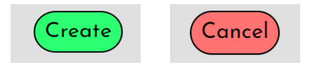

Push the button “create” for the event to appear on the Planner or push the button “cancel” if you change your mind. 
After cancelling you will be on the page “Planner”.

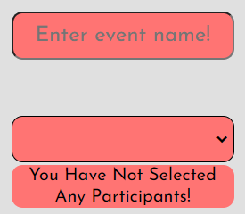

A prerequisite for creating an event is the presence of the event name and participants. 
If you missed one of these graphs, then we will definitely inform you.

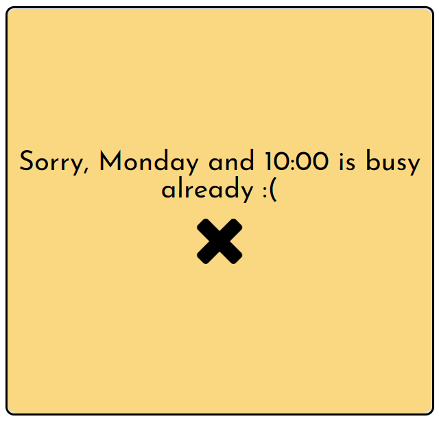

If the day and time have already taken, we will also inform you.
